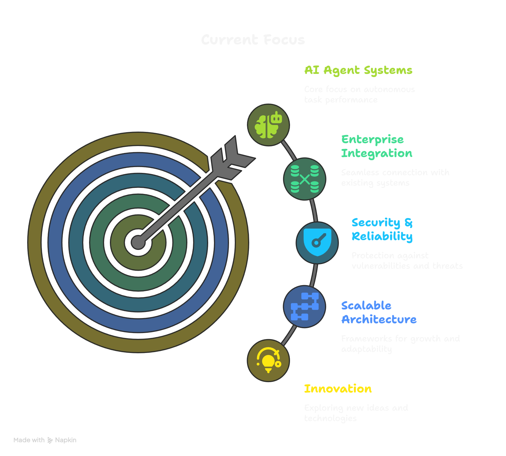

# 👋 Hi there, I'm Alperen!

  
  
  
  

## 🚀 About Me

> **Machine Learning Engineer & AI Systems Architect** pioneering the future of AI-powered enterprise solutions 🤖

I'm a passionate technologist who bridges the gap between cutting-edge AI research and real-world applications. Currently pursuing my M.Sc. in Software Engineering while architecting innovative AI agent systems at **E-Istatistik**.

### 🎯 What I Do

- 🤖 **AI Agent Architect**: Designing autonomous AI systems before "agents" were cool (2023!)
- 🧠 **LLM Whisperer**: Making Large Language Models dance to enterprise needs
- 🛡️ **AI Security Researcher**: Hunting prompt injection vulnerabilities to build bulletproof AI systems
- 🏀 **FIBA Basketball Referee**: Because making split-second decisions under pressure is my thing!

---

## 🎓 Education Journey

📚 **M.Sc. Software Engineering** (2023 - Present)  
🎓 **B.Sc. Software Engineering** (2019 - 2023)  
🏆 **High School Valedictorian** - 98.60/100 GPA  

---

## 🌟 Notable Achievements

### 🔬 Research & Innovation

#### 🤖 AI Interview Agent System (2023)
> **Pioneered AI agent architectures before they were mainstream!**

Built an autonomous interview system that:
- 📄 Processes CVs intelligently
- 🎙️ Conducts interviews with visual/audio synthesis
- 🧠 Makes hiring decisions autonomously

### 🏗️ Production Impact

- ⚡ **Performance Boost**: Through microservices architecture optimization
- 🚀 **Thousands of Daily API Requests**: Handled at enterprise scale
- 📱 **Cross-Platform Mobile Apps**: Serving thousands of active users
- 🔒 **AI Security Framework**: Developed defensive strategies against prompt injection

---

## 🌍 Beyond Code

### 🏀 FIBA Basketball Referee
*Because making fair decisions under pressure translates perfectly to system design!*

### 🗣️ Languages
- 🇬🇧 **English**: Advanced C1 (CAE Certified)
- 🇹🇷 **Turkish**: Native

### 🎯 Soft Skills That Matter
- **Technical Leadership** 👥
- **System Architecture** 🏛️
- **Research Collaboration** 🔬
- **Cross-functional Communication** 💬

---

## 📈 Current Focus

---

## 🤝 Let's Connect!

I'm always excited to discuss:
- 🤖 AI agent architectures and LLM applications
- 🏗️ Scalable system design
- 🔒 AI security and prompt engineering
- 🏀 Basketball and sports tech

  
  ### 📬 Reach out and let's build something amazing together!
  
  
  

---

  
  *"Building the future, one AI agent at a time"* 🚀
  

